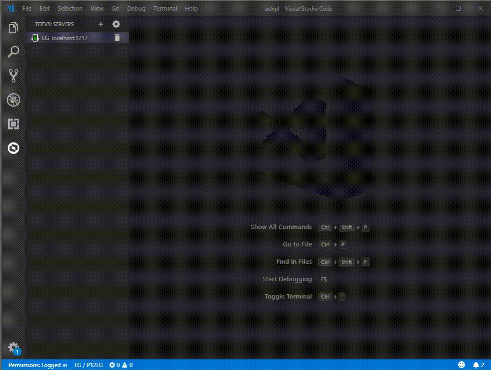
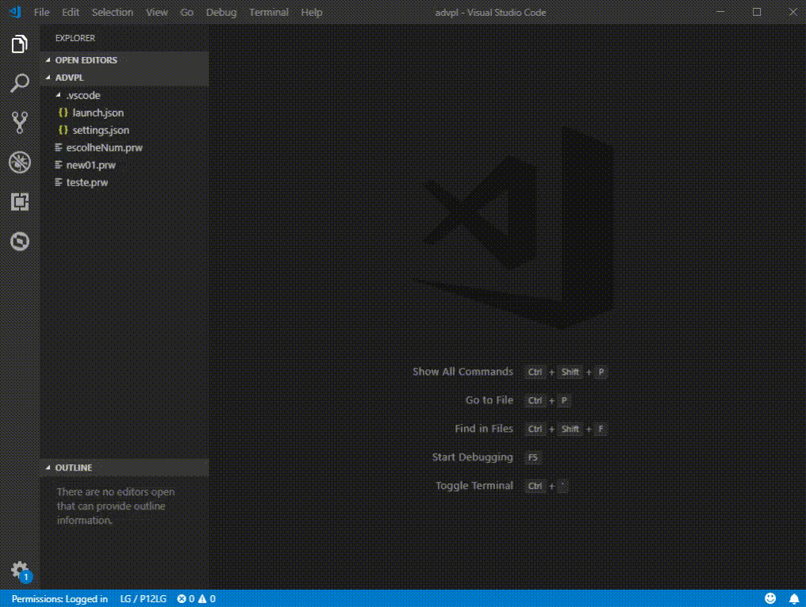

### Gerando um Patch (From RPO) utilizando o assistente.

- Para gerar um patch conecte-se ao servidor.

- Selecione com o botão direito do mouse o servidor conectado.
- Selecione a opção `Patch Generation (From RPO)`.
- Existe um atalho para a abertura da página: `CTRL + SHIFT + P ` digite `TOTVS` e selecione a opção `TOTVS: Patch Generation (From RPO)`.

- Aguarde a carga dos arquivos do inspetor de objetos.
- Selecione os arquivos que desejar para o patch utilizando o campo de `Filtro`.
- Para digitar o filtro simplesmente saia do campo ou pressione `Enter`.
- Selecione agora os arquivos na lista da esquerda e mova os desejados para lista da direita utilizando o botão `">>"`.
- Repita o processo até que tenha selecionado todos os arquivos necessários.
- Selecione agora o `diretório` onde deseja salvar o Patch.
- Escolha o `nome do arquivo` de Patch desejado. (Quando não informado, o patch será gerado com o nome do RPO).
- Efetue e geração do Patch pressionando o botão `Gerar`.

### Gerando um Patch (From Folder) utilizando o menu de contexto

- Para gerar um patch conecte-se ao servidor.
- Clique com o botão direito em cima da pasta de contém os fontes que farão parte do patch.
- Selecione a opção `Patch Generation (From Folder)`.
- Abrirá uma janela para selecionar onde deseja que o fonte seja salvo. Selecione um pasta.
- Uma janela será aberta para coletar o nome do patch que será gerado. (Quando não informado, o patch será gerado com o nome do RPO).
- Após as confirmações o patch será gerado no caminho desejado.

