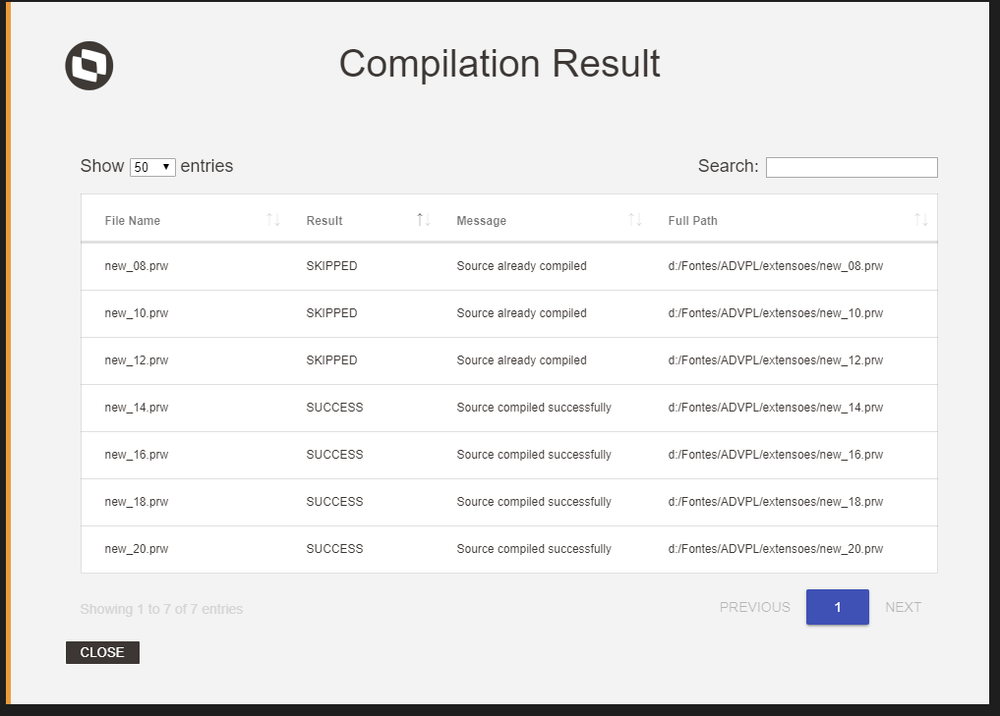

## Compilação

### Compilando fonte do editor corrente

* Para compilar o fonte do editor corrente acione o atalho `CTRL + F9`. Ou pelo atalho `CTRL + SHIFT + P` digite `TOTVS: Compile Selection`.
A compilação efetuada a partir do editor, sempre irá recompilar o fonte, mantendo assim o mesmo comportamento do TDS-Eclipse.

* Para recompilar o fonte do editor corrente acione o atalho `CTRL + SHIFT + F9`.

### Compilando todos os fontes abertos

* Para compilar todos os fontes dos editores abertos acione o atalho `CTRL + F10`. Ou pelo atalho `CTRL + SHIFT + P` digite `TOTVS: Compile Open Editors`.

* Para recompilar todos os fontes dos editores abertos acione o atalho `CTRL + SHIFT + F10`.

### Resultado da compilação

* Caso queira limpar o console antes da compilação, habilite a opção: `File | Preferences | Settings | Extensions | TOTVS |Clear Console Before Compile`.

* Para analisar o resultado da compilação de múltiplos arquivos, exite a opção de abrir uma tabela com informações de todos os arquivos que foram compilados.

* Para exibir essa tabela, selecione mais de um arquivo, compile e após a compilação será apresentada a pergunta a seguir: Clique em `Yes`.

* A tabela abaixo será exibida, ordenada pela coluna de resultado.

* Exite nas preferencias uma maneira de habilitar e desabilitar a pergunta sobre a abertura da tabela.

* Clique em `File | Preferences | Settings` e digite `totvsLanguageServer.askCompileResult` no campo de pesquisa.

## Configurações de Compilação

### Compilando Function e Main Function com Chave de compilação

- Este processo está sendo revisto e pode sofrer alterações.

- Para aplicar uma chave de compilação, clique com o botão direito na visão de servidores e selecione a opção `Compile key`.
- Abrirá um assistente para selecionar a chave que deseja. Todos os arquivos .aut podem ser selecionados.
- Também é possível abrir o assistente pelo atalho `CTRL + SHIFT + P` digirantando `TOTVS: Compile Key`.
- Após selecionar a chave, ela será lida e os campos preenchidos com suas informações.
- Clique sobre o botão de `Validate` para verificar se a chave é válida.

- OBS: A chave só será salva ao clicar no botão `Save` ou `Save/Close` caso a chave seja válida.

## Chave de compilação

- A partir de 17/05/2019 todas as chaves devem ser regeradas utilizando o ID exibido no nosso plugin do VSCode. Isse se faz necessário para suporte de Linux e MAC.

- Suporte de chave de compilação em Linux e MAC a partir de 17/05/2019.

### Configuração de Include

- Na visão de servidores, clique com o menu de contexto e selecione a opção `Include`.
- Também é possível configurar pelo assistente: `CTRL + SHIFT + P` digite `TOTVS: Include`.

- As configurações de include ficam no arquivo `%USERHOME%/.totvsls/servers.json`. Abra esse arquivo.
- Já existe por padrão o diretório `"C:/totvs/includes"`.
- Para adicionar uma nova configuração de include separe por vírgula ou substitua o path existente.
  Ex:`"includes": ["C:/totvs/includes1","C:/totvs/includes2", "C:/totvs/includes3"]`.

### Arquivos do pré compilador

- Para manter os arquivos gerados pelo pré-compilador, habilite a opção nas preferencias em: `File | Preferences | Settings | Extensions | TOTVS |Leave PPO File`.
- Caso queira um log completo das operações efetuadas pelo pré-compilador, habilite a opção: `File | Preferences | Settings | Extensions | TOTVS |Show Pre Compiler`.
