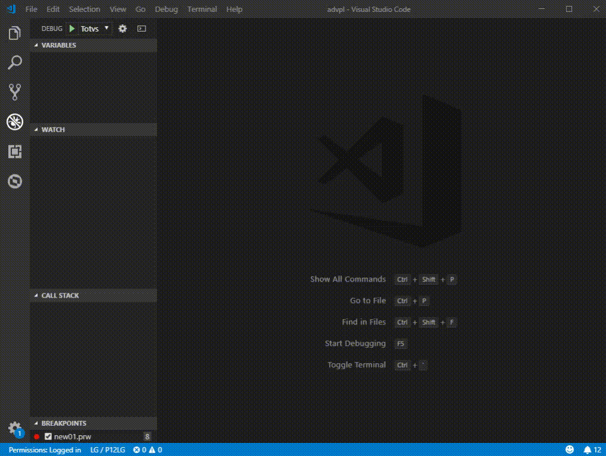
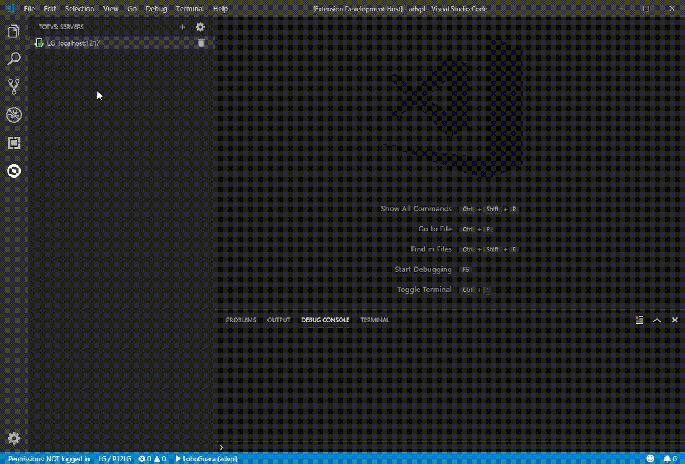
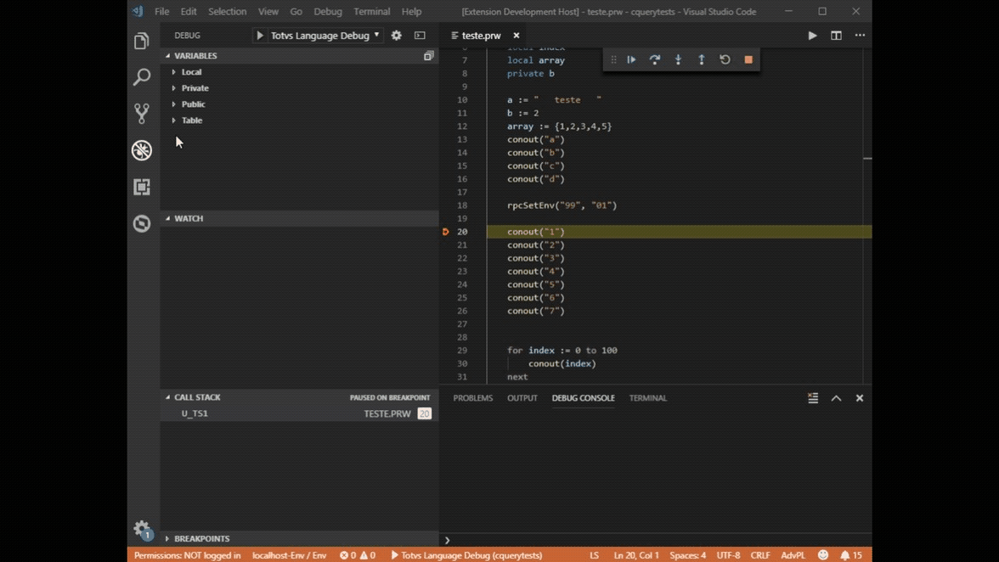
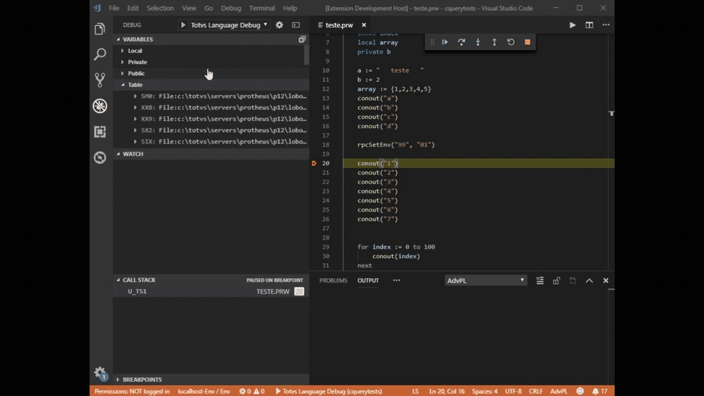
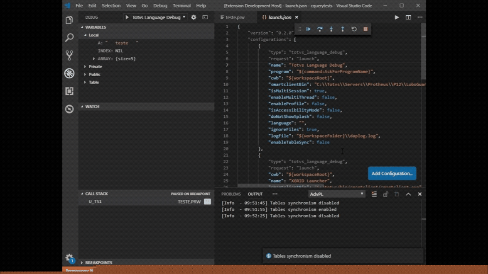
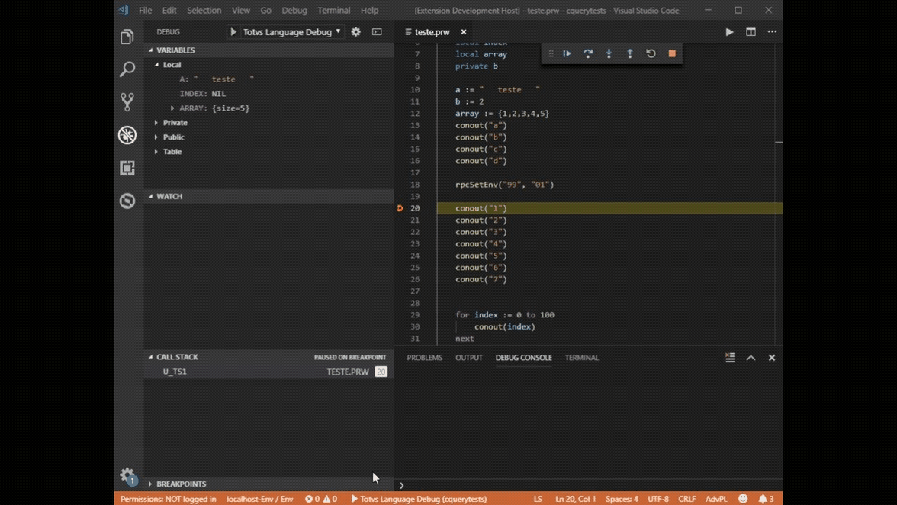

## Configurações de Debug

### Criando manualmente uma configuração de debug

- O arquivo `launch.json` será criado automaticamente através da Tela de Boas Vindas.
- Caso haja problemas com este arquivo você pode criá-lo manualmente através dos seguintes passos:

  - Selecione a seção `Debug` no painel esquerdo do VSCode.
  - Selecione na parte superior desta tela a opção `Add Configuration...`.
  - Comece a digitar `TOTVS` e selecione o tipo desejado
    - Tipo: _totvs_language_debug_, usa o SmartClient Desktop.
      Preencha o arquivo `launch.json` de acordo com seu ambiente e necessidas, como no exemplo abaixo.

> `{`
> "type": "totvs_language_debug",
> "request": "launch",
> "name": "TOTVS Language Debug",
> "program": "${command:AskForProgramName}",
"cwb": "${workspaceFolder}",
> "smartclientBin": "/home/mansano/\_c/totvs12/bin/smartclient/smartclient",
> "isMultiSession": true,
> "enableTableSync": true
> `}`

    * Tipo: _totvs_language_web_debug_, usa o SmartClient Html.
      Preencha o arquivo `launch.json` de acordo com seu ambiente e necessidas, como no exemplo abaixo..

> `{`
> "type": "totvs_language_web_debug",
> "request": "launch",
> "name": "TOTVS Language Debug",
> "program": "${command:AskForProgramName}",
"cwb": "${workspaceFolder}",
> "smartclientUrl": "<http://localhost:8080>",
> "isMultiSession": true,
> "enableTableSync": true
> `}`

_Nota:_ Abra o arquivo `settings.json` e informe a chave "", com o caminho completo do seu navegador web.

> `{`
> "totvsLanguageServer.welcomePage": false,
> "totvsLanguageServer.web.navigator": "C:\\Program Files\\Mozilla Firefox\\firefox.exe"
> `}`

Veja detalhes sobre como usar as diretivas [\${command:}](https://link) e [passagem de parâmetros](https:link).

### Criando uma configuração de debug com assistente

- Para abrir o assistente de nova configuração de debug, pressione o atalho `CTRL + SHIFT + P` e digite `TOTVS: Configure Launchers`.
- Será aberto um assistente de configuração de launcher que permite criar uma nova configuração ou editar uma configuração já existente.
- Preencha as informações e clique em `Save`.

### Iniciando um debug

- Caso necessário, verifique se os dados do arquivo `launch.json` estão corretos.
- Conecte-se a um servidor previamente cadastrado.
- Pressione o atalho `F5` para iniciar o debug.
- Caso necessário abrir o `launch.json` novamente, Selecione a seção `Debug` no painel esquerdo do VSCode
- E por fim no ícone de configuração na parte superior `Open launch.json`, representado pelo icone de uma `engrenagem`.
- Será exibido um campo para digitação do fonte que deseja depurar, ex: `u_teste`.
- Pressione `Enter` para iniciar a depuração.

### Usando Debug Console

- É possível verificar os valores de variáveis, conteúdo de tabelas e executar métodos durante o debug com o Debug Console.
- Coloque um breakpoint em um ponto necessário de seu fonte.
- Quando a depuração "parar" ao breakpoint, abra a visão `Debug Console` na parte inferior da tela.
- Digite uma operação ou variável AdvPL/4GL disponivel em seu ambiente de depuração.
- Para verificar o conteúdo de uma tabela aberta, digite o seguinte comando: table:nome_da_tabela (ex.: table:SM0)
- Analise os dados retornados de acordo com sua necessidade.

Em [Debug Console: configuração visual](https://github.com/totvs/tds-vscode/wiki/Debug-Console:-configura%C3%A7%C3%A3o-visual), você tem detalhes de como customizar o visual desta visão.

### Sincronismo de tabelas durante o debug

- O sincronismo de tabelas pode ser alterado por configuração de "launcher" pelo parâmetro: enableTableSync
- Ele vem habilitado por padrão em uma nova configuração de execução.

- É possível alterar essa opção durante uma depuração pelo comando: "TOTVS: Toggle table sync". Note que ao usuar esse comando, o parâmetro do launcher é alterado, portanto a próxima depuração irá utilizar essa definição. Ou seja, caso tenha sido desabilitado, a próxima depuração iniciará com o sincronismo de tabelas desabilitado também.

- É possível visualizar o conteúdo de uma tabela aberta usando a visão "Debug Console". Para isso digite o seguinte comando na visão: table:nome_da_tabela (ex.: table:SM0)

